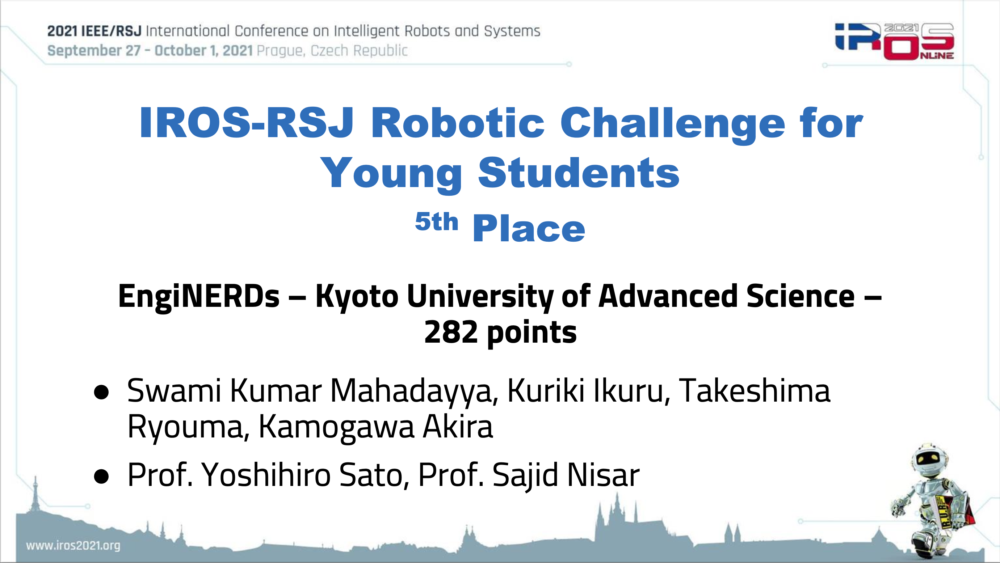
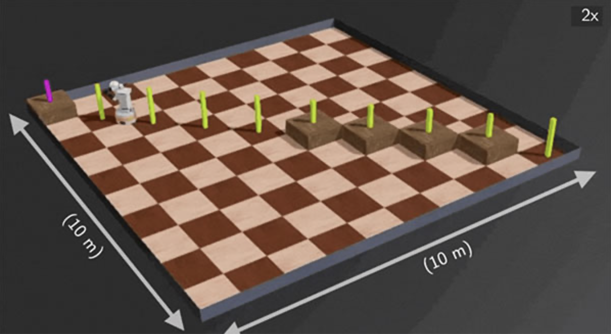
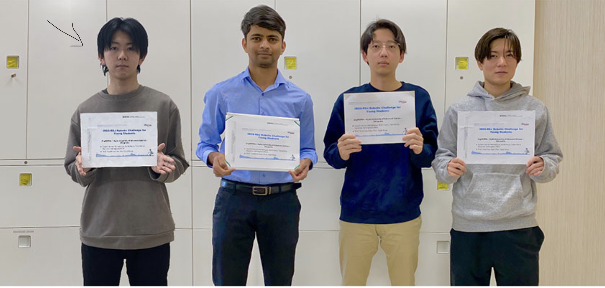

# 🎯 課外活動

## 🤖 国際ロボコン（IROS 2021）
私は2021年に開催された **IEEE/RSJ International Conference on Intelligent Robots and Systems (IROS)** の一環として行われたロボットコンペティションに参加し、 **世界5位入賞** を果たしました。この大会は **IEEE（国際電気電子学会）** と **日本ロボット学会（RSJ）** が合同で主催するロボティクス分野の権威ある国際会議であり、世界中の大学生や研究者が参加する競技会の一部として実施されました。

### 🏆 **大会概要**
- **大会名:** 2021 IEEE/RSJ International Conference on Intelligent Robots and Systems (IROS)
- **開催形式:** オンライン開催（2021年7月～9月）
- **競技内容:**  
  - **第1ステージ:** 屋内環境での自律走行ロボットの開発  
  - **第2ステージ:** 移動可能なベースに取り付けられたロボットアームを用いた作業タスクの遂行
- **決勝進出条件:** 厳正な審査のもと、世界中から **5チームのみが決勝に進出**
- **結果:** **決勝進出、世界5位入賞（賞状と賞金を獲得）**

### 🛠 **私の役割**
この競技では、ロボットのソフトウェア開発において **C++ を用いたプログラムの実装** を担当しました。私にとっては **C++ を本格的に学ぶ初めての機会** であり、短期間での学習と実装が求められました。以下の点に注力し、プロジェクトに貢献しました。

- **ロボットの自律移動アルゴリズムの開発**
  - LiDAR やカメラを活用した自己位置推定
  - 経路計画（Path Planning）と障害物回避の実装
  - PID 制御によるモーター制御の最適化

- **ロボットアームのタスク実行**
  - アームの制御プログラムの実装（ROSを使用）
  - 物体認識のための OpenCV を用いた画像処理
  - 効率的なピック＆プレースアルゴリズムの開発

- **チームとの協力**
  - 多国籍チームメンバー（インド人学生など）との英語での技術的議論
  - Git を活用したソースコードのバージョン管理
  - オンラインでのタスク分担と進捗管理

### 🚀 **学んだこと**
このプロジェクトを通じて、私は **短期間で新しいプログラミング言語を学び、実装する力** を身につけました。また、 **ロボットの自律移動・アーム制御技術** についても深く理解することができました。特に、 **ROS（Robot Operating System）** の使用経験は、今後の研究や開発に大きく役立つスキルとなりました。

さらに、国際的な大会への参加を通じて **英語での技術的なコミュニケーションスキル** や **チームでのプロジェクト遂行力** も向上しました。異なるバックグラウンドを持つメンバーと協力し、互いの強みを活かすことで、限られた時間の中で最大の成果を出す経験を得ることができました。

---

## 📱 **アプリ開発**
私はこれまで **アプリ開発のリーダー** として複数のプロジェクトに取り組んできました。

### 🏗 **Capstoneプロジェクト（数ミリ単位の部品をカウントするアプリ開発）**
- **プロジェクト概要:**  
  - 数ミリ程度の微小部品を **画像処理技術を活用して自動カウント** するアプリを開発
  - **Python + OpenCV を用いた画像認識技術** を活用
  - 精度の高い物体検出アルゴリズムの設計と実装
- **役割:**  
  - チームリーダーとして、タスクの進行管理を担当
  - **Swift（未経験の言語）を学習し、iOS アプリを開発**
  - 参考文献・論文を調査し、精度向上のためのアルゴリズムを改良
- **成果:**  
  - 高精度な部品カウント機能を実装し、企業への提案を実施
  - **アプリ開発の基礎から応用までの経験を獲得**

### 🖥 **その他のアプリ開発**
- **Pythonを用いた画像解析ツールの開発**
  - 研究で使用する画像処理の自動化
  - MATLAB との比較検討を実施し、処理速度の最適化を行う
- **研究計算ツールの開発**
  - Excel では処理が困難な計算を Python で自動化
  - **GUI を実装し、直感的に操作できるツールを開発**

---

## 🏆 **その他の課外活動**
### 🎓 **学内外の研究発表**
私は **学内・学外の研究会や学会で積極的に研究発表** を行っています。

- **摂南大学合同研究会（2024年）**
  - **発表内容:** 高耐久アルミニウム合金薄膜の機械特性
  - **使用技術:** スパッタリング成膜、SEM・FIB解析、引張試験
  - **発表成果:** 他大学の研究者とのディスカッションを通じ、新たな仮説を構築
- **MEMS研究コンソーシアム**
  - 企業との共同研究の経験
  - **産業応用を意識した材料研究の視点を学ぶ**
- **ナノリサーチ京都での研究成果発表**
  - **糖尿病センサー開発・磁気分離技術** についてプレゼン
  - **企業向けに実用性を重視した発表を実施**

---

## 📸 **フォトギャラリー**

---

[🔙 ホームへ戻る](/)
