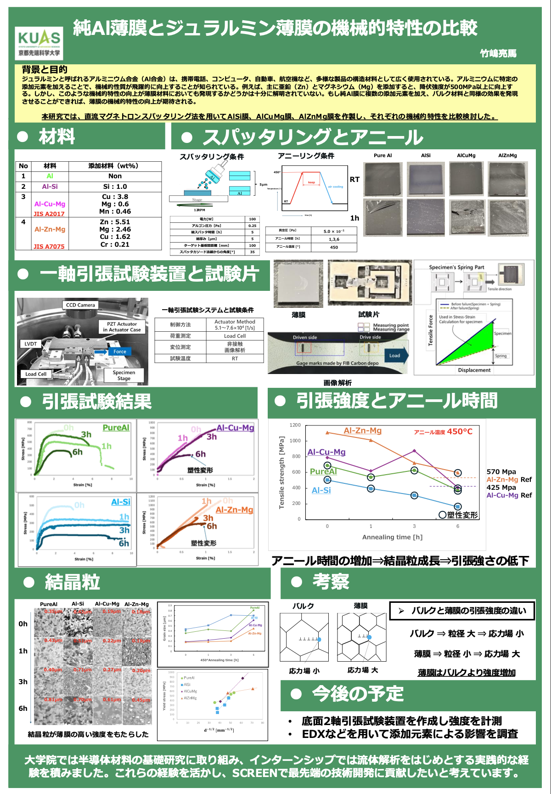

# 🔬 研究内容
## 📌 研究テーマ
**高耐久アルミニウム合金の探索と薄膜機械特性の比較**

## 🔍 研究概要
私の研究では、高耐久性を持つアルミニウム合金の開発を目的とし、薄膜の機械的特性を評価しています。MEMSデバイスや電子機器において、材料の強度と耐久性は非常に重要な要素です。従来のAl-Si合金に代わる新たな合金をスパッタリング技術で成膜し、引張試験やFIB観察を通じてその特性を評価しています。

## 🛠 使用技術・装置
- **シミュレーション:** Murata Femtet, Fusion 360
- **計測装置:** SEM, FIB, TEM, 引張試験機
- **成膜技術:** スパッタリング, 迅速加熱アニール

## 🔍 研究成果
- **薄膜の強度向上**: 270°C でスパッタした薄膜の強度が 700MPa に向上
- **微細構造の最適化**: 粒径 280nm の最適条件発見

[🔙 ホームへ戻る](/)
